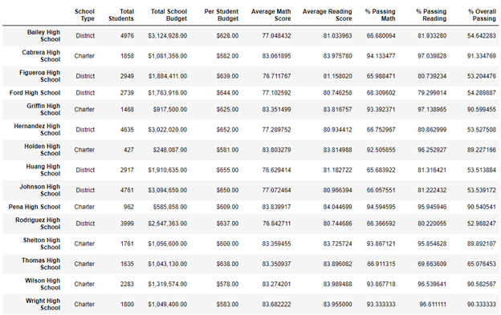
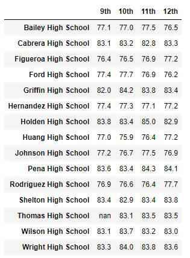
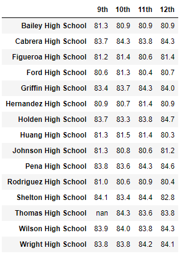
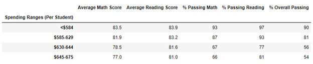
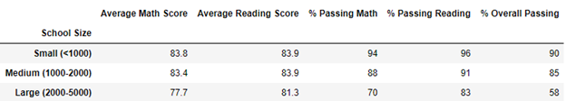
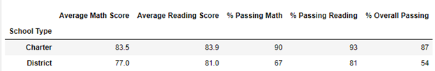
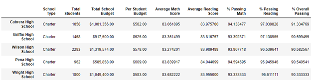

# school_district_analysis
Week 4 - Pycity Schools with Panda, using Python

## Overview of the School Districy Analysis
The school board has found evidence of academic dishonesty amongst the reading and math grades from Thomas High School's ninth grade students. The school board is unsure of the extent of how compromised the data that was given to them so in order to keep with state-testing standards, we have been tasked to replace the scores math and reading scores for Thomas High School's ninth grade class with NaNs (Not a Number) while keeping the remaining data in place in order to determine the extent of the changes.

## Results

The previous analysis showed the following differences for Thomas High School: Average Math Score (83.41), Average Reading Score (83.84), Percent Passing Math (93.27%), Percent Passing Reading (97.30%), and Percent Overall Passing (90.94%) while the graph above lists the following for Thomas High School: Average Math Score (83.35), Average Reading Score (83.89), Percent Passing Math (66.91%), Percent Passing Reading (69.66%), and Percent Overall Passing (65.07%) when rounded to the nearest hundreth. Their average math, reading and overall percentages have dipped signficantly due to the NaNs in place.

**How does replacing the ninth-grade scores affect the following:**

**1. Math and Reading Scores by Grade**

>The above graph is showing the math scores by grade, and Thomas High School currently has a NaN in place for their 9th grade class. Their previous average math score was 83.6.

>This graph is showing the reading scores by grade, with Thomas High School's previous score 83.7. 

**2. Scores by School Spending**

>The $630-$644 Spending Range Per Student differed from the previous analysis. The percentages for the following areas were: Passing Math at 73%, Passing Reading at 84% and Overall Passing at 63%.

**3. Scores by School Size**

>Of the school sizes, the "Medium" school size was different than the previous analysis; the following are percentages from the previously completed analysis: Passing Math at 94%, Passing Reading at 97% and Overall Passing at 91%.

**4. Scores by School Type**

>Between District and Charter schools, the Charter school had a difference in the Math, Reading and Overall categories. Passing Math was 94%, Passing Readin was 97% and Overall Passing was 90%

## Summary

The most significant changes due to the academic dishonesty from Thomas High School were the amount per student ($630-644), size (Medium), and type (Charter).

The four major changes in the school district analysis after taking out the inaccurate data are listed below.

1. Thomas High School's passing percentages have decreased significantly for math, reading, and their overall percentage.

2. The drop in their passing percentages may have also inadvertently caused Thomas High School to be knocked out of their spot in the top 5 schools as seen below with the addition of Wright High School entering the top 5.

3. When it comes to school size, the medium-sized schools have dropped in all percentages as shown in the table containing the school size information.

4. Under school types, charter schools' percentages have also dropped overall.
